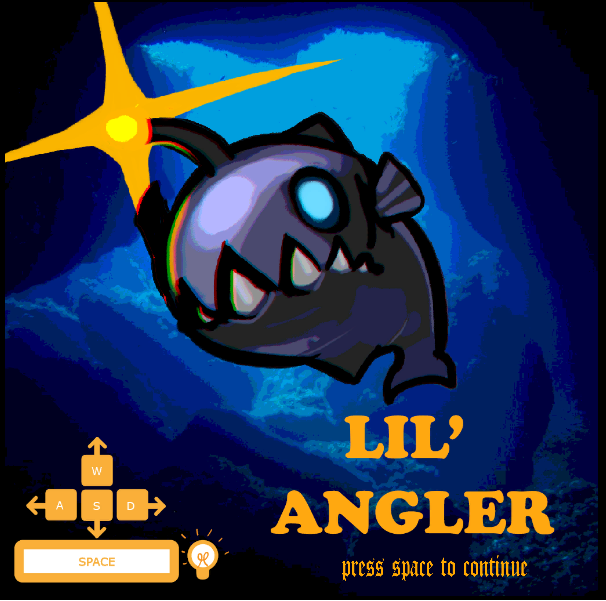

# Lil-Angler

A single-player game where you navigate through the deep sea as an angular fish and eat smaller fish to replenish your energy. You can activate you light to attract your prey toward you but it also attracts your sea monster predator toward you too.

*** <b>As of Chrome 42 (Released April 14th), NPAPI plugins are disabled by default! That means Unity Player, Java, and Silverlight games will not work in the Chrome browser! That said, Flash in the Chrome browser continues to work fine (PPAPI).</b>

<a href="http://l3ubbleman.github.io/Lil-Angler.">Website</a>
